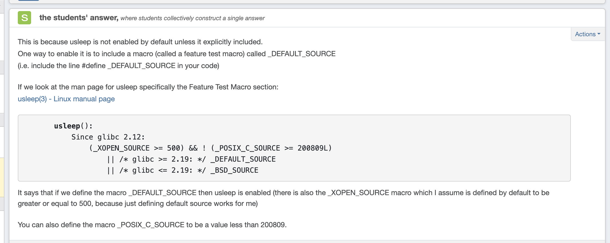

# System Monitoring Tool (SMT)

[](https://en.wikipedia.org/wiki/C_(programming_language))
[](https://www.linux.org/)
[](LICENSE)

A **high-performance, real-time system monitoring tool** built in C that provides concurrent system performance analysis with terminal-based graphical visualizations.

## 🚀 Key Features

- **Real-time monitoring** of CPU usage, memory utilization, and core information
- **Concurrent data collection** using multi-process architecture with fork/pipe IPC
- **Terminal-based ASCII graphics** for live data visualization
- **Configurable monitoring options** with flexible command-line interface
- **Signal handling** for graceful user interaction (SIGINT/SIGTSTP)
- **Modular architecture** with clean separation of concerns

## 💻 Technical Highlights

- **Concurrent Programming**: Multi-process design using `fork()` and `pipe()` for parallel data collection
- **System Programming**: Direct interaction with Linux `/proc` filesystem for real-time metrics
- **Memory Management**: Efficient resource handling with proper cleanup and error handling  
- **Signal Processing**: Custom signal handlers for user interaction and process control
- **Modular Design**: Well-structured codebase with separate modules for different functionalities

## 🛠️ Technologies & Skills Demonstrated

- **Systems Programming** in C with POSIX compliance
- **Inter-Process Communication** (IPC) using pipes
- **Concurrent Programming** with process forking and synchronization
- **Linux System Calls** and `/proc` filesystem interaction
- **Terminal UI Programming** with ANSI escape sequences
- **Memory Management** and resource cleanup
- **Error Handling** and robust program design


## 🏗️ Architecture & Design

### Concurrent Processing Strategy
The application implements a **multi-process architecture** for optimal performance:

1. **Parent Process**: Handles UI rendering, graph plotting, and coordination
2. **Child Processes**: Dedicated workers for data collection tasks:
   - CPU metrics collection from `/proc/stat`
   - Memory utilization from `/proc/meminfo` 
   - CPU core count and frequency detection
   - Real-time data sampling with configurable intervals

### Inter-Process Communication
- **Pipe-based IPC**: Each child process communicates results via dedicated pipes
- **Process Synchronization**: Parent waits for child completion before data processing
- **Resource Management**: Proper cleanup of pipes and process reaping

### Data Flow
```
┌─────────────┐    ┌──────────────┐    ┌─────────────────┐
│   Parent    │────│    Pipes     │────│  Child Workers  │
│  (UI/Graph) │    │     IPC      │    │ (Data Collection)│  
└─────────────┘    └──────────────┘    └─────────────────┘
       │                                         │
       └──── Terminal Graphics ←─── Raw Data ────┘
```


## 📁 Project Structure

```
system-monitoring-tool/
├── main.c                 # Main program logic and concurrency control
├── SMT_fetch_data.c/.h    # System data collection (/proc filesystem)
├── SMT_plot_func.c/.h     # Terminal graphics and visualization
├── SMT_Logic.c/.h         # Command-line argument parsing
├── SMT_structs.c/.h       # Data structures and type definitions
├── helper_func.c/.h       # Utility functions and helpers
├── makefile              # Build configuration
└── README.md             # Project documentation
```

## 🔧 Quick Start

### Prerequisites
- Linux operating system
- GCC compiler with C99 support
- Terminal with ANSI escape sequence support

### Compilation
```bash
make
```

### Basic Usage
```bash
# Monitor all metrics with defaults (20 samples, 0.5s intervals)
./a3

# Monitor specific components
./a3 --memory --cpu      # Memory and CPU only
./a3 --cores            # CPU cores information only

# Custom sampling
./a3 10 1000000         # 10 samples, 1-second intervals
./a3 --samples=15 --tdelay=200000  # 15 samples, 0.2s intervals
```

## 📊 Sample Output
The tool displays real-time ASCII graphs showing:
- **Memory Usage**: 12-level graph with total system memory visualization
- **CPU Utilization**: 10-level percentage-based graph (0-100%)
- **Core Information**: Grid display of CPU cores with frequency information

---

## 🔍 Technical Implementation Details

### Core Functions Overview

#### **Process Management** (`main.c`)
- **Signal Handling**: Custom SIGINT handler with user confirmation dialog
- **Concurrent Execution**: Multi-process architecture using `fork()` and `pipe()`
- **Resource Management**: Proper cleanup of pipes and child process reaping

#### **System Data Collection** (`SMT_fetch_data.c`)
- **CPU Metrics**: Parse `/proc/stat` for real-time CPU utilization calculation
- **Memory Analysis**: Extract memory statistics from `/proc/meminfo`
- **Hardware Detection**: CPU core count and frequency from `/sys/devices/system/cpu/`

#### **Terminal Graphics** (`SMT_plot_func.c`)
- **ASCII Visualization**: Real-time graph rendering using ANSI escape sequences
- **Dynamic Scaling**: Adaptive graph scaling based on system specifications
- **Cursor Management**: Precise terminal positioning for multi-section displays

#### **Command-Line Processing** (`SMT_Logic.c`)
- **Flexible Parsing**: Support for both positional and flag-based arguments
- **Input Validation**: Comprehensive error checking and argument validation
- **Configuration Management**: Runtime parameter setup for monitoring options

#### **Data Structures** (`SMT_structs.c`)
- **CPU Information**: Structured data for CPU timing and utilization metrics
- **Memory Allocation**: Dynamic memory management for monitoring data

#### **Utility Functions** (`helper_func.c`)
- **Type Conversion**: String validation and unit conversion utilities  
- **Terminal Control**: ANSI escape sequence management for cursor positioning

---

## 🎯 Learning Outcomes & Skills

This project demonstrates proficiency in:
- **Systems Programming**: Low-level Linux system interaction and resource management
- **Concurrent Programming**: Multi-process design patterns and IPC mechanisms
- **Memory Management**: Efficient resource allocation and cleanup in C
- **Error Handling**: Robust error detection and graceful failure management
- **Code Organization**: Modular design with clean separation of concerns
- **Performance Optimization**: Real-time data processing with minimal overhead

## 📈 Performance Characteristics
- **Real-time Updates**: Sub-second refresh rates with configurable intervals
- **Low Overhead**: Minimal system impact through efficient data collection
- **Scalable Design**: Modular architecture supports easy feature extensions
- **Resource Efficient**: Proper cleanup prevents memory leaks and zombie processes

## 👨‍💻 Author
**Daniel Venistan** - Systems Programming Student, University of Toronto

---

## 📄 Additional Technical Details

### Detailed Function Documentation
- Installs a custom SIGINT handler and ignores SIGTSTP to prevent suspending.
- Declares and initializes variables such as `samples`, `tdelay`, and `system_monitoring_flags`.
- Calls parse_command_line_arguments to set `samples`, `tdelay`, and `system_monitoring_flags` based on user input.
- Clears the terminal screen and sets up labels and graph axes with `system_monitoring_tool_label_generator` and `graph_generator`.
- If cores monitoring is requested parent creates pipes and forks children to fetch the number of cores and max CPU frequency each writing their result to pipes waiting to be read from the parent.
- If memory or CPU monitoring is requested parent repeatedly forks child processes to fetch memory usage or CPU info in a for loop of length samples, waits for them, reads their data, and plots the results using plot_update_memory_utilization and plot_update_cpu_utilization.
- Sleeps between samples using `usleep(tdelay)`.
- When monitoring cores waits for and reads the core and frequency data from the pipes then calls generate_cores to display that information after we finish pringin the graphs in the for loop.
- Finally it moves the cursor below the graph using terminal_cursor_mover to keep the final place for the terminal output below everything.


## catch_function in `main`

- Moves the cursor to row 35 using  so that the prompt appears below the rest of the output.
- Asks the user if they want to quit or continue.
- Reads the user’s response into `user_answer`.
- If the user types `y`, sends `SIGKILL` to the entire process group (effectively terminating the program).
- If the user types anything else, clears the prompt from the terminal and returns to continue execution.


## parse_command_line_arguments in `SMT_Logic`

- Parses the command-line arguments to configure the SMT.
- Processes the arguments to determine the number of samples, the delay between samples (`tdelay`), and which system monitoring flags are set (Memory, CPU, Cores).
- The first two arguments, if they are integers, are used for `samples` and `tdelay`, respectively.
- If integers are found in positions other than the first two arguments, the function returns -1 for fail.
- Checks for propositional arguments passed as flags in the form of `--tdelay=N` and `--samples=N`.
- Checks for multiple flags in the form of `--tdelay=N` and `--samples=N` if both are provided the function returns an -1.
- If both propositional arguments and integer flags for `tdelay` or `samples` are provided simultaneously the function returns an -1.
- Sets the system monitoring flags based on the presence of `--memory`, `--cpu`, and `--cores`.
- If no specific monitoring flags are provided, all flags default to monitoring Memory, CPU, and Cores.
- If no arguments are provided, the function defaults to monitoring Memory, CPU, and Cores.
- Returns `0` on success or `-1` for fail


## system_monitoring_tool_label_generator `SMT_plot_func`

- Generates the static labels for the SMT based i.e  "Nbr of samples: 20 -- every 500000 microseconds (0.5 secs)" and "v Memory" and etc.
- Moves the terminal cursor and prints labels for different sections: Memory, CPU, and Number of Cores.
- Uses the `system_monitoring_flags` array to determine which sections to display:
  - `system_monitoring_flags[0]`: memory section flag 1 to display "v Memory", 0 to hide
  - `system_monitoring_flags[1]`: cpu section flag 1 to display " vCPU", 0 to hide
  - `system_monitoring_flags[2]`: number of Cores section flag 1 to display " v Number of Cores: %d @ %.2f GHz", 0 to hide
- Uses the `indexes` array to determine cursor positions for each section:
  - `indexes[0]`: cursor position for the Memory section.
  - `indexes[1]`: cursor position for the CPU section.
  - `indexes[2]`: cursor position for the Number of Cores section.
- Displays labels based on the flags provided to ensure the correct sections are presented.
- Uses `samples` to show the user how many data points will be displayed.
- Uses `tdelay` to show the user the delay between plotting data points in microseconds.


## graph_generator `SMT_plot_func`

- Sets up the axes and defines the maximum and minimum values for the system monitoring graph.
- Uses terminal cursor movements to position the axes correctly in the terminal.
- Uses the `system_monitoring_flags` array to determine which graphs to configure:
  - `system_monitoring_flags[0]`: Memory usage graph flag 1 to display, 0 to hide.
  - `system_monitoring_flags[1]`: CPU usage graph flag 1 to display, 0 to hide.
- Uses the `indexes` array to determine the starting positions for the graphs:
  - `indexes[0]`: starting position for the memory usage graph.
  - `indexes[1]`: starting position for the CPU usage graph.
- Uses `samples` to determine how long to make the a-xis of the graph.
-Y-axis of the graphs for CPU and Memory are fixed with CPU having a graph height of 10 which means 10 intervals to plot the points and Memory with height of 12 which means 12 intverals to plot the points.
- Updates `final_cursor_position` to figure out how much rows the grpahical interface has used I know where to place the cursor last so its just right below the graphs.
- Defines graph's structure using predefined offsets:
  - `memory_offset`: offset for the memory usage graph.
  - `cpu_offset`: offset for the CPU usage graph.
  - `y_axis_offset`: offset for the y-axis.
  - `x_axis_offset`: offset for the x-axis.
- Defines and labels the maximum and minimum values for the graphs.
- Uses the following helper functions:
  - `terminal_cursor_mover(int row, int col)`: Moves the terminal cursor to the specified row and column.
  - `get_total_memory_gb()`: Returns the total memory in GB.
- This function does not plot any data points; it only sets up the graph's structure.


## generate_cores in `SMT_plot_func`

- Generates a grid of squares representing CPU cores.
- This function is only called if `system_monitoring_flags[2] == 1`, which is determined in `generate_system_monitoring_tool`.
- Uses the input `num_sqaures` and `max_freq` to print the label "v Number of Cores: %d @ %.2f GHz\n"
- Prints the core grid in the terminal with a maximum of 4 squares per row.
- Uses the `indexes` array for cursor positioning:
  - `indexes[2]`: Determines the starting row for printing the core grid.
- Updates `final_cursor_position` to track the last cursor position used.

## fetch_num_cores in  `SMT_fetch_data`

- Fetches the number of CPU cores available on the system.
- Reads the `/proc/cpuinfo` file to determine the number of CPU cores.
- Counts the occurrences of the word `"processor"` in the file as each occurrence corresponds to a core.
- Returns the number of CPU cores detected.
- Program exits with exit(1) if there is an error opening the file.
-`for more informaiton refer to `


## get_total_memory_gb in  `SMT_fetch_data`
- Calls the helper function `fetch_proc_meminfo_categor_value_in_gb("MemTotal")` to get the total memory.
- Returns the total memory available in the system in gigabytes.

## fetch_proc_meminfo_categor_value_in_gb in `SMT_fetch_data`
- Fetches the value of a specified memory category from `/proc/meminfo` in gigabytes.
- Reads the `/proc/meminfo` file and searches for the given memory category (e.g., `"MemTotal"`).
- If the category is found, extracts the value in kilobytes and converts it to gigabytes.
- Uses the helper function `kb_to_gb(long long kilobytes)` to perform this conversion.
- Returns the value of the specified memory category in gigabytes.
- If there is an error reading the file or the specified category is not found, the program prints an error message and terminates using `exit(1)`.

## calc_cpu_percentage in  `SMT_fetch_data`

- Calculates the CPU usage percentage.
- Computes CPU usage based on the difference in total CPU time and idle CPU time between consecutive readings.
- Uses the `CPU_INFO` struct pointer `instance`, which stores previous CPU times after a delay that is handled by `usleep` in `populate_graphs`.
- When this function runs, the delay has already occurred.
- Retrieves the previous total CPU time `previous_sum` and previous idle time `previous_idle` from `instance` and stores them in `previous_sum` and `previous_idle`.
- Calls `fetch_cpu_info(instance)` to update `instance` with the latest CPU time values.
- Computes `total_delta`, which is the difference between the updated total CPU time (`instance->cpu_sum`) and `previous_sum`.
  - If `total_delta` is less than or equal to `0`, returns `0.0` to prevent division errors.
- Computes `idle_delta`, which is the difference between the updated idle CPU time `instance->idle` and `previous_idle`.
- Calculates CPU usage as a percentage using the formula given on piazza but mines is the same algebra can be done to show it.  
$$ \text{CPU Usage} = 100.0 \times \left(1.0 - \frac{\text{idle\_delta}}{\text{total\_delta}}\right) $$

- Returns the CPU usage percentage in the range of `0.0 – 100.0`.


## fetch_cpu_info in  `SMT_fetch_data`

- Retrieves CPU usage information from the system and updates a `CPU_INFO` structure.
- Opens the `/proc/stat` file and reads the first line to gather CPU usage metrics.
- Extracts CPU time counters, including user, system, idle, and other usage statistics.
- Computes the total sum of all CPU time counters.
- Stores the total CPU time and idle time in the provided `CPU_INFO` structure.
- Uses the `instance` pointer to update the values in the structure.

### Process:
1. Read the first line of `/proc/stat`.
2. Ignore the first field (`cpu`).
3. Extract all numeric values and compute:
   - **Total CPU time**: The sum of all values.
   - **Idle time**: The 4th value in the list.
4. Store these computed values into the `CPU_INFO` structure:
   - **`instance->cpu_sum = cpu_sum`**: Stores the total CPU time, which represents the sum of all CPU activity (useri + nicei + sysi + idlei + IOwaiti + irqi + softirqi +  the last two which are just zero).
   - **`instance->idle = idle`**: Stores the idle CPU time, which specifically represents the portion of time the CPU was not active.


## fetch_memory_utilization_instance

- Fetches the current memory utilization in gigabytes.
- Uses helper functions to retrieve total and available memory from `/proc/meminfo`.
- Computes the memory usage by subtracting available memory from total memory.
- Returns the used memory in gigabytes.

### Process:
1. Calls `fetch_proc_meminfo_categor_value_in_gb("MemTotal")` to retrieve the total system memory in gigabytes.
2. Calls `fetch_proc_meminfo_categor_value_in_gb("MemAvailable")` to retrieve the currently available memory in gigabytes.
4. Computes the current memory used using the equation:
   $$
   \text{Memory Used} = \text{Total Memory} - \text{Available Memory}
   $$
5. Returns the computed memory usage in gigabytes.


## plot_update_memory_utilization

- Plots and updates memory utilization data on a graphical interface within the terminal.
- Computes memory usage ranges based on total system memory.
- Divides total memory into **12 intervals** and determines where the current memory utilization belongs.
- Plots a point (`"#"`) at a specific row/column position based on memory ranges and the current sample.
- Displays the total memory utilization value next to the plotted point.

### Assumptions:
- **Memory usage is divided into 12 equal intervals**, where each interval represents a portion of total system memory.
- If **memory utilization is 0 GB**, it is explicitly plotted on the **x-axis**.
- If **memory utilization is greater than 0 GB**, it falls within one of the 12 defined intervals.
- The function uses cursor positioning to correctly place the data in a structured terminal output.

### Process:
1. **Initialize constants for plotting:**
   - `x_axis`: Determines the row for plotting.
   - `y_values_offset_right`: Adjusts the horizontal placement of the data.
   - `intervals = 12`: The memory utilization is divided into 12 equal parts.
   - `total_memory_gbs`: Retrieves the total system memory in GB.
   - `interval_value`: Calculates the size of each interval:
     \[
     \text{interval\_value} = \frac{\text{total memory in GB}}{12}
     \]

2. **Special Case - Handle exactly 0 GB memory utilization:**
   - If `mem_utilization_gbs == 0`, meaning no memory is in use:
     - Move the cursor to the corresponding row and column.
     - Print the total memory utilization value (`0.00 GB`).
     - Plot the `"#"` directly on the x-axis.
     - Exit the function early using `return` to avoid unnecessary loop execution.

3. **Loop through the 12 intervals for all other cases:**
   - For each `i` from `0` to `11`:
     - Compute the interval bounds:
       $$
       \text{interval\_start} = i \times \text{interval\_value}
       $$
       $$
       \text{interval\_end} = (i + 1) \times \text{interval\_value}
       $$
     - Check if `mem_utilization_gbs` falls within the **exclusive lower bound and inclusive upper bound**:
       ```c
       if (mem_utilization_gbs > interval_start && mem_utilization_gbs <= interval_end)
       ```
       - If true:
         - Move the cursor to the corresponding row.
         - Print the current memory utilization value.
         - Move the cursor to the correct plotting position.
         - Print `"#"` at the correct row and column.
         - Exit the loop early using `break` after plotting.

## plot_update_cpu_utilization

- Plots and updates CPU utilization data on a graphical interface within the terminal.
- Determines the appropriate graph index based on the CPU utilization percentage.
- Plots a point (`":"`) at a specific row/column position based on CPU utilization and the current sample.
- Displays the CPU utilization percentage next to the plotted point.

### Assumptions:
- CPU utilization is represented as a **percentage (0–100%)**.
- The graph is divided into **10 levels** each representing a **10% range**.

### Process:
1. **Validate CPU Utilization Input:**
   - The function only executes if `cpu_utilization_percentage` is between **0 and 100%**.
   
2. **Initialize Constants for Plotting:**
   - `x_axis`: Determines the row for plotting.
   - `y_values_offset_right`: Adjusts the horizontal placement of the data.
   - `index`: Represents the vertical level where the CPU utilization point will be plotted.

3. **Display CPU Utilization Value:**
   - Moves the cursor to `indexes[1], 8` and prints the **CPU utilization percentage**.

4. **Determine Graph Index for CPU Utilization:**
   - The CPU utilization is divided into **11 levels**, each covering a range of **10%**:
     - `0%` → Index `0`
     - `1–10%` → Index `1`
     - `11–20%` → Index `2`
     - `21–30%` → Index `3`
     - `31–40%` → Index `4`
     - `41–50%` → Index `5`
     - `51–60%` → Index `6`
     - `61–70%` → Index `7`
     - `71–80%` → Index `8`
     - `81–90%` → Index `9`
     - `91–100%` → Index `10`
   - The correct **index is assigned based on the range** in which the CPU utilization falls.

5. **Plot the CPU Utilization Point (`":"`):**
   - Moves the cursor to the calculated row and column based on:
     $$
     \text{x-axis position} = x\_axis - \text{index} + 1
     $$
     $$
     \text{y-axis position} = y\_values\_offset\_right + \text{sample}
     $$
   - Prints the **":"** symbol to represent CPU utilization at the correct location.

## fetch_max_frequency_in_GHz

- Fetches the maximum CPU frequency in **GHz**.
- Reads the maximum CPU frequency from the system file:  
  `/sys/devices/system/cpu/cpu0/cpufreq/scaling_max_freq`
- Converts the frequency from **kHz to GHz** before returning the value.

### Process:
1. **Open the file** `/sys/devices/system/cpu/cpu0/cpufreq/scaling_max_freq` for reading.
2. **Read the frequency value** from the file, which is in **kHz**.
3. **Convert the frequency from kHz to GHz** using the formula:
   $$
   \text{CPU Frequency (GHz)} = \frac{\text{CPU Frequency (kHz)}}{1,000,000}
   $$
4. **Return the CPU frequency in GHz**.
5. **Error Handling:**
   - If the function fails to open or read the file, it prints an error message.
   - Returns an appropriate default value (e.g., `-1`) in case of failure.


## **Installation**
This program requires the user to run it on a `Linux system`. As a student at `UofT`, this program was tested using the `IA-3170 workstations`.

## **3. How to Compile the Code**
A **Makefile** is provided in the project directory to automate compilation.

### **To Compile the Program**
Run the following command in the terminal:
```bash
make
```

Here is the make file which you will use.

```bash
CC = gcc
CFLAGS = -Wall -g -std=c99 -Werror -D_POSIX_C_SOURCE=200809L
OBJ = main.o helper_func.o SMT_fetch_data.o SMT_Logic.o SMT_plot_func.o SMT_structs.o
HEADERS = helper_func.h SMT_fetch_data.h SMT_Logic.h SMT_plot_func.h SMT_structs.h

all: a3

a3: $(OBJ)
	$(CC) $(CFLAGS) -o $@ $^

%.o: %.c $(HEADERS)
	$(CC) $(CFLAGS) -c $< -o $@

.PHONY: clean
clean:
	rm -f *.o assignment3

```

- `all: a2` → Defines `a2` as the main target to be built.
- `a2: $(OBJ)` → Specifies that `a2` depends on the compiled object files (`.o` files).
- `%.o: %.c $(HEADER_FILES)` → Compiles each `.c` file into an object file `.o` ensuring that changes to header files trigger recompilation.
- `.PHONY: clean` → Marks `clean` as a phony target preventing conflicts with any file named `clean`.
- `make clean` → Deletes all compiled files ensuring a fresh build.

Note -D_POSIX_C_SOURCE=200809L in my compilation flag I use this to stop the readlink problem I had sourced from piazza!

### **To Compile the Program**
Simply run the following command in the termina to comiple the executable:
```sh
make
```
or you can run 

```sh
make a3
```
Given the executable a3 goo look at the **usage** section to learn how to run possible different version of the code

This will comiple all necessary object files and link them into an exectuable "a2".

### **Compiling a Single Object File**
If you want to compile a specific object file separately you can run.
```sh
make data_processing_a2.o
```
Here `%` can be replaced with any of the files in the program i.e you can do 

```sh
make %.o
```

### Clean compiled Files
If you want to remove all objects files .o and the executable a2 then run the follwoing.

```bash
make clean
```

## **Usage** 
The program accepts both **flag-based** and **positional** command-line arguments.  
- **Flag-based arguments** can be passed to the tool in any order.  
- **Positional arguments** indicating **samples** and **tdelay** must always be the first ones.

### **Command-Line Arguments**

```bash
./a3 [samples [tdelay]] [--memory] [--cpu] [--cores] [--samples=N] [--tdelay=T]
```

## **Default Execution**

If no arguments are passed, the program presents all information about **memory utilization**, **CPU utilization**, and **cores**. Default values are:
- `samples = 20`
- `tdelay = 500000` microseconds

```bash
./a3
```

## Some Valid Command Line Arguments Examples

### Monitor only Memory Usage with default samples = 20 and tdelay = 500000
```bash
./a3 --memory
```

### Monitor only CPU Usage with default samples = 20 and tdelay = 500000
```bash
./a3 --cpu
```

### Monitor only Core Information with default samples = 20 and tdelay = 500000
```bash
./a3 --cores
```

### Monitor only Core and Memory Information  with default samples = 20 and tdelay = 500000
```bash
./a3 --cores --memory
```

### Monitor for 10 Samples with a 1-Second Delay
```bash
./a3 --samples=10 --tdelay=1000000
```

### Using Positional Arguments with samples = 15 and tdelay = 200000
```bash
./a3 15 200000 --cpu --memory
```

## **Test Cases**
If anything spelt wrong or formatted wrong will lead to undefined behaviour and it wont be valid and the program will just end. The following are behaviour I needed to check like inputting both propositional arguments and flags for them. 

## INVALID Command Line Arguments Examples

### If both propositional arguments and flags for `tdelay` or `samples` are provided, the function returns an error.
```bash
./a3 15 200000 --cpu --memory --tdelay=200000 --samples=15
```

### Cannot have more than one flag for `tdelay` or `samples`this is undefined behaviour
```bash
./a3 --cpu --memory --tdelay=200000 --samples=15 --tdelay=500000 --samples=60
```
### If integers are found in positions other than 1 and 2, the function returns an error.
```bash
./a3 15 200000 --cpu --memory 30 700000
```


## **Disclaimer**


https://man7.org/linux/man-pages/man3/usleep.3.html

From piazza I used #define _DEFAULT_SOURCE to ignore the sleep warning.

I was not able to find a nice place to put the question when user does ctrl-c and the question printf("Do you want to quit or continue? (y,n): "); I just print it at the depth if there was both cpu and memeory on the graph so its at 35,0 for my code so it user just did --cpu or  --memeory the question might seem little to far below.

When pressing crtl-z if spammed fast it enough it will interefere with the cpu graph while it its printing.

https://users.cs.cf.ac.uk/Dave.Marshall/C/node24.html#SECTION002420000000000000000

used for the line  signal(SIGTSTP, SIG_IGN);


